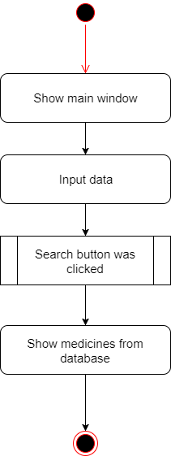
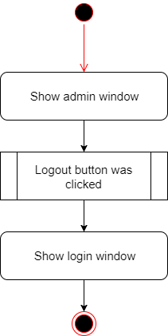
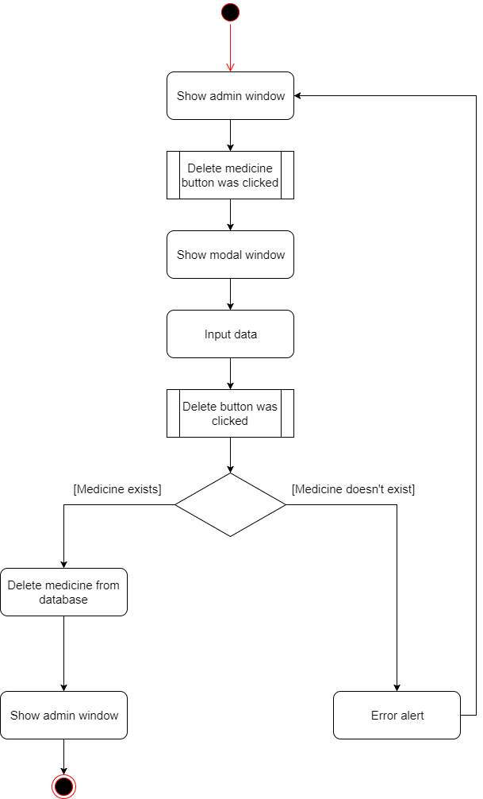
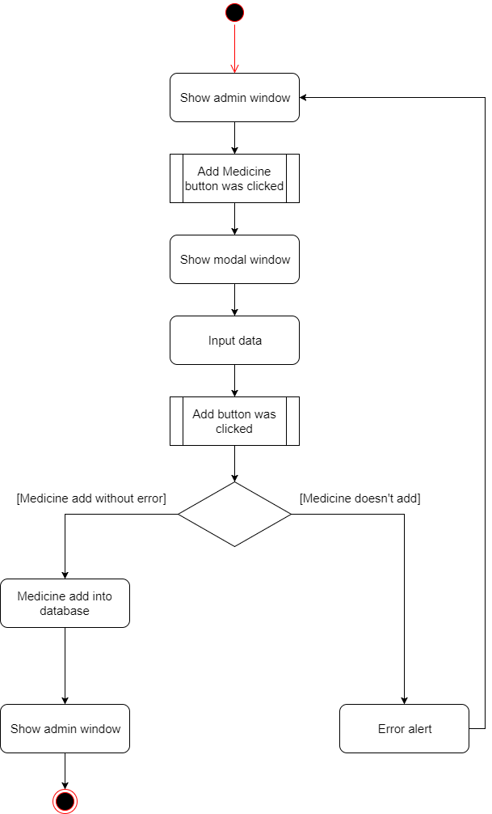
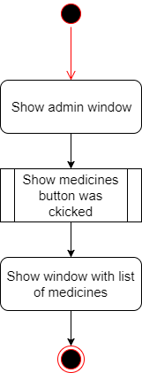
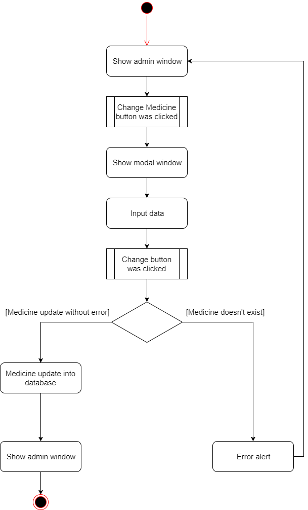

# Диаграммы активностей
---

# Содержание
1 [Авторизация](#authorization)  
2 [Поиск препарата](#search)  
3 [Выход из учетной записи](#logout)  
4 [Удаление препарата](#delete)  
5 [Добавление препарата](#add)  
6 [Вывод препаратов](#show)  
7 [Изменение препарата](#change)

<a name="authorization"/>

# 1 Авторизация
  

<a name="search"/>

# 2 Поиск препарата
  

<a name="logout"/>

# 3 Выход из учетной записи

<a name="delete"/>

# 4 Удаление препарата

<a name="add"/>

# 5 Добавление препарата

<a name="show"/>

# 6 Вывод препаратов

<a name="change"/>

# 7 Изменение препарата

