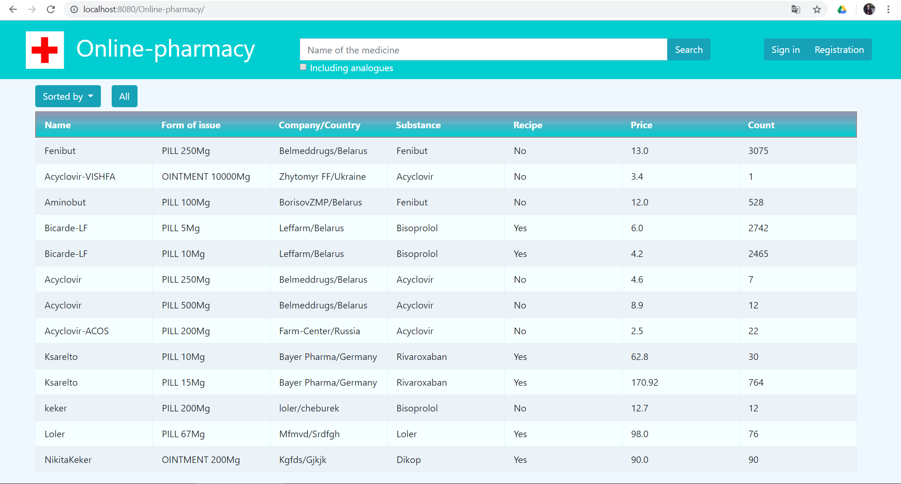
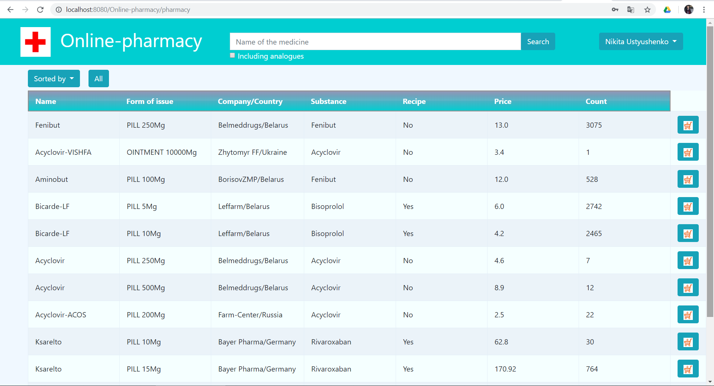
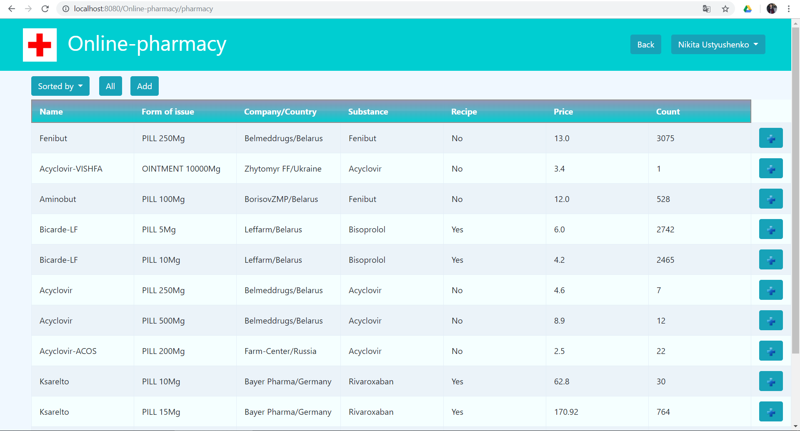
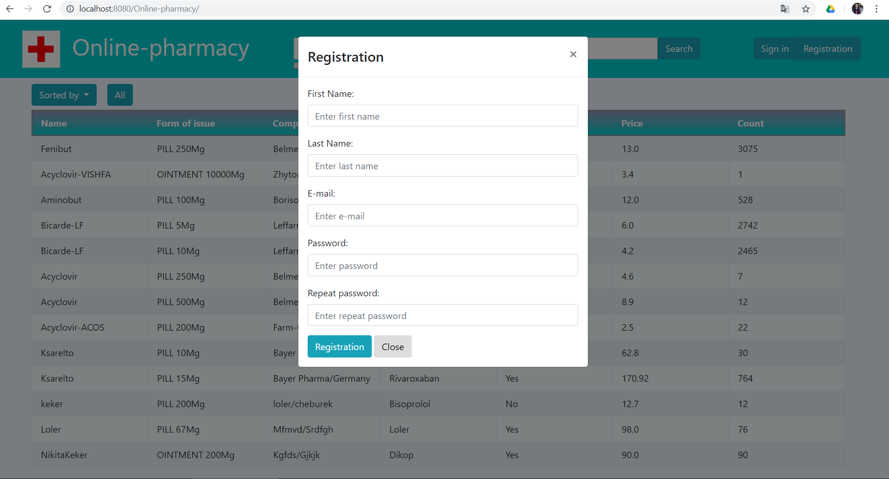
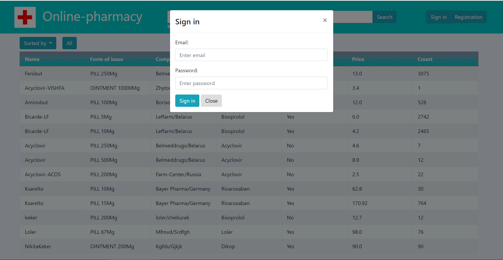

# Требования к проекту
---
# Содержание

# 1 Введение

В этом документе описаны функциональные и нефункциональные требования к веб-приложению «Online-pharmacy». Данный проект содержит всю необходимую функциальность для работы с онлайн-аптекой. Также на сайте предусмотрены роли: клиент, администратор, гость, врач.

# 2 Требования пользователя

### 2.1 Интерфейс пользователя

- Стартовая страница
  
- Страница клиента
  
- Страница администратора
  
- Модальное окно регистрации пользователя
  
- Модальное окно авторизации
  

### 2.2 Характеристики пользователей

### 2.2.1 Классы пользователей
1. Гость - пользователь, который не зарегистрирован на сайте, однако может просматривать весь имеющийся список лекарственных препаратов.
2. Клиент - пользователь, который зарегистрирован на сайте, имеет право осуществлять заказ.
3. Администратор - зарегистрированный пользователь, который может управлять всеми данными на сайте(добавлять лекарства и т.д.).
4. Врач - зарегистрированный пользователь, который имеет право выписывать рецепт или нет.

#### 2.2.2 Целевая аудитория

 Любой человек, нуждающийся в быстрой покупке лекарственного средства.
